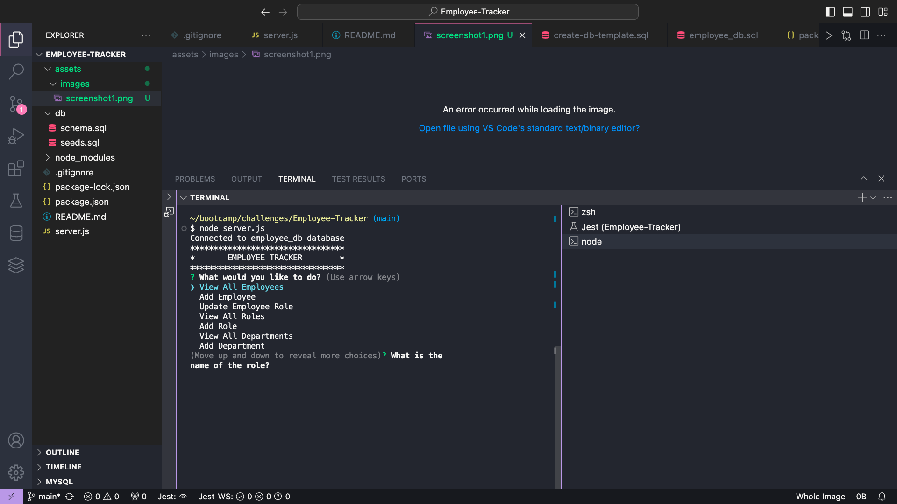
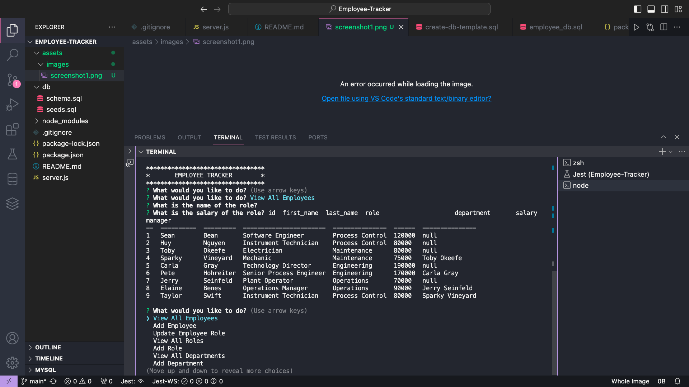
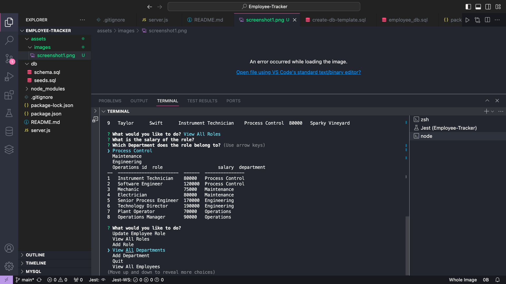

# Employee Tracker

## Keep up with your most important resource!

## Licensing:

## Table of Contents
- [User Story](#user-story)
- [Description](#description)
- [Installation](#installation)
- [Usage](#usage)
- [License](#license)
- [Screenshots](#Screenshots:)
- [Walkthrough Demo](#Link_to_Screencastify_Video_for_Demonstration:)

- [Questions](#questions)

## User Story:
AS A business owner

I WANT to be able to view and manage the departments, roles, and employees in my company

SO THAT I can organize and plan my business

## Description:
This database was created as a exercise in using SQL for managing data.  It lets the user input departments, roles, and employees. I also lets users update employees' roles and salaries. The user can view a table of departments, roles, and employees before and after these updates

## Installation:
- Download from Github
- Install inquirer, mysql, console.table and mysql2 are installed.
- You can connect to this particular database, which is not protected by a password. For actual professional use, the database would be password-protected.

## Usage:
- Navigate to employee_tracker folder in terminal.
- Type npm init -y into terminal to create a new .json file
- Type npm i into terminal
- Type npm i inquirer into terminal
- Type npm i mysql2 into terminal
- Type npm i console.table into terminal
- Navigate to the db folder
- Type mysql -u root into terminal
- Type source schema.sql into terminal
- Type source seeds.sql into terminal
- Type quit into terminal
- Navigate back to the the employee_tracker folder in terminal
- Type node server.js into the terminal
- Answer prompts to view, add, and update the database. Use arrow keys.

## Link_to_Screencastify_Video_for_Demonstration:

https://app.screencastify.com/v2/manage/videos/iwPUKjNg1sEVexBGNNh9

## Screenshots:

;
;
;

## License:
MIT

